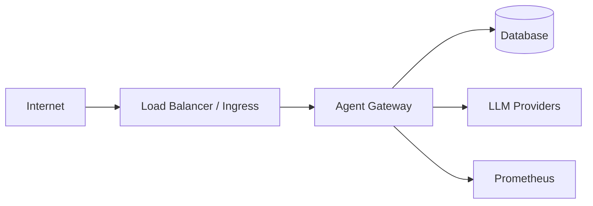

# Security & Threat Model — Enterprise Agent Gateway

> **Portfolio platform** — STRIDE-oriented analysis for interview and design review. Not a formal production assessment.

## Scope

- FastAPI service (`POST /v1/agents/run`, health, metrics)
- Demo API key authentication
- Tool access to synthetic CRE data
- Outbound calls to LLM providers (or fake providers in demo)
- Deployment manifests (Docker, Kubernetes, ECS example)

## Assets

| Asset | Sensitivity |
|-------|-------------|
| Provider API keys | High |
| Tenant CRE data (synthetic) | Medium |
| API keys (demo) | Medium |
| Policy YAML | Medium |
| Evaluation datasets | Low |
| Metrics / logs | Low–Medium |

## Trust boundaries

## STRIDE summary

| Threat | Example | Mitigation in repo | Residual risk |
|--------|---------|-------------------|---------------|
| **Spoofing** | Stolen API key | Hashed key lookup; tenant binding | Demo keys are short-lived secrets in README |
| **Tampering** | Modified tool args | Pydantic validation; policy checks | No HMAC on requests |
| **Repudiation** | Deny agent action | Structured logs + request/trace IDs | No immutable audit store |
| **Information disclosure** | Cross-tenant data leak | Tenant filters on tools; eval cases | FTS does not encrypt at rest |
| **Denial of service** | Flood `/v1/agents/run` | In-memory rate limit | No edge WAF or distributed limiter |
| **Elevation of privilege** | Employee invokes admin tool | `tool_permissions.yaml` by role | File-based, not central IAM |

## Prompt injection & tool abuse

| Vector | Control |
|--------|---------|
| Indirect prompt injection via retrieved docs | Output guardrails; citation requirements |
| Tool over-invocation | `MAX_TOOL_STEPS` ceiling |
| Dangerous maintenance mutations | Role checks + idempotency keys |
| Cost exhaustion | `max_cost_usd` per request |

## Secrets handling

- `.env` gitignored; `.env.example` has no real secrets.
- Kubernetes `secret.example.yaml` uses placeholders.
- Terraform accepts **Secrets Manager ARNs only** — no values in state by default.
- Dockerfile runs as UID 10001 (non-root).

## Network controls

- Kubernetes `NetworkPolicy` restricts ingress to ingress-controller and monitoring namespaces; egress limited to DNS/HTTPS patterns.
- ECS security group allows task ingress only from ALB SG.

## Supply chain

- Dependencies pinned via `pyproject.toml`; CI runs Ruff + pytest.
- Container built from official `python:3.12-slim` base.

## Recommended hardening (out of scope)

1. OIDC / mTLS for service-to-service auth
2. External policy engine (OPA/Cedar) with audit trail
3. WAF + bot detection at edge
4. KMS encryption for SQLite/Postgres and object storage
5. Periodic key rotation and secret scanning in CI

## Incident response hooks

- Runbook: [runbook-provider-outage.md](runbook-provider-outage.md)
- Postmortem template: [postmortem-simulated-provider-outage.md](postmortem-simulated-provider-outage.md)
- Metrics: `agent_policy_denials_total`, `agent_provider_failovers_total`
